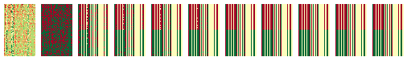
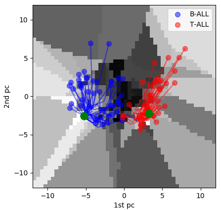
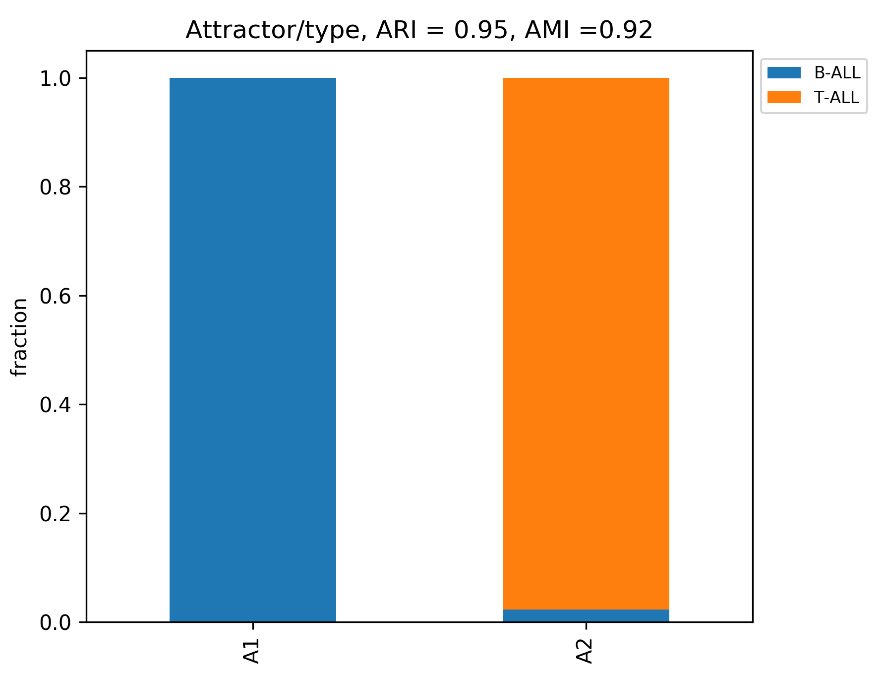
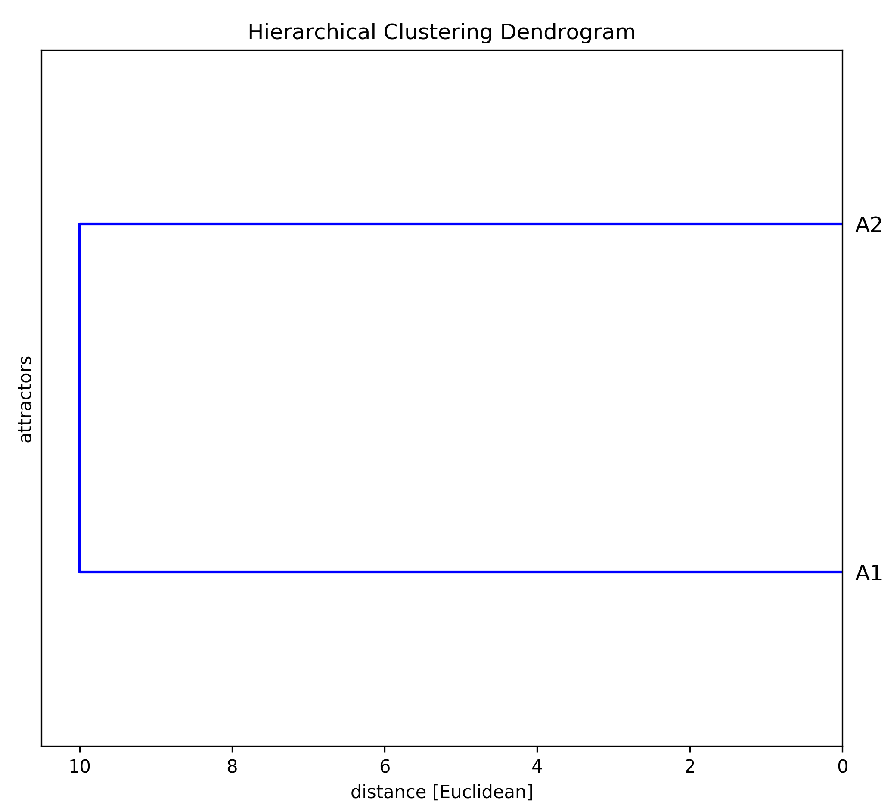
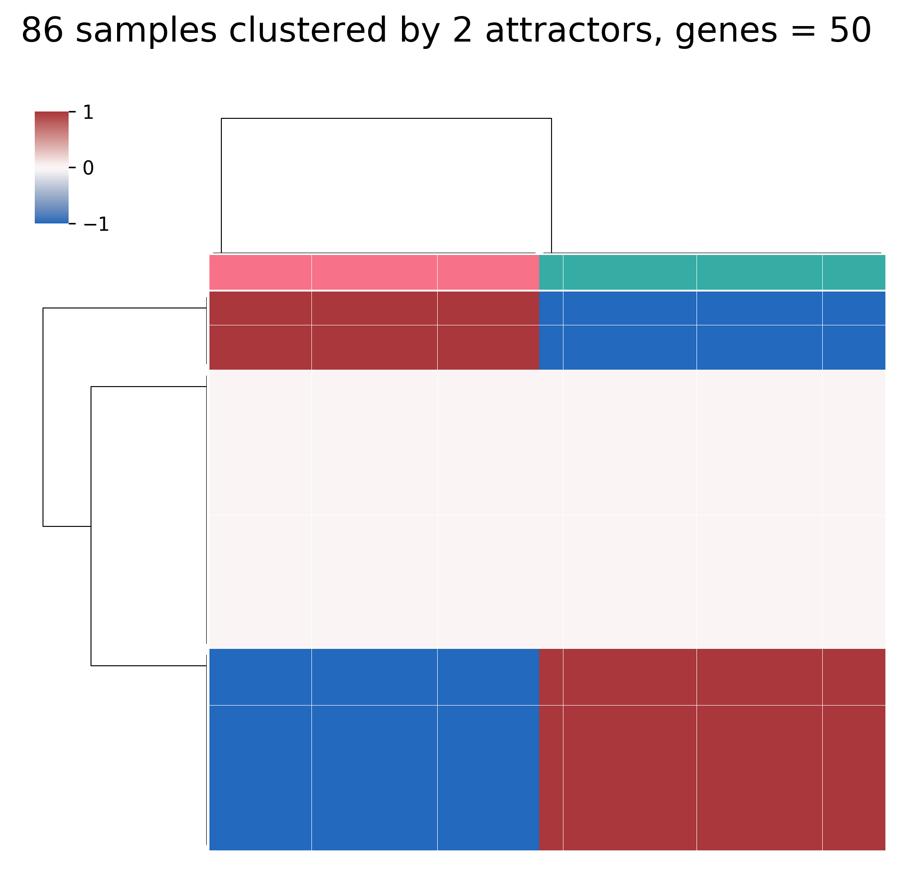
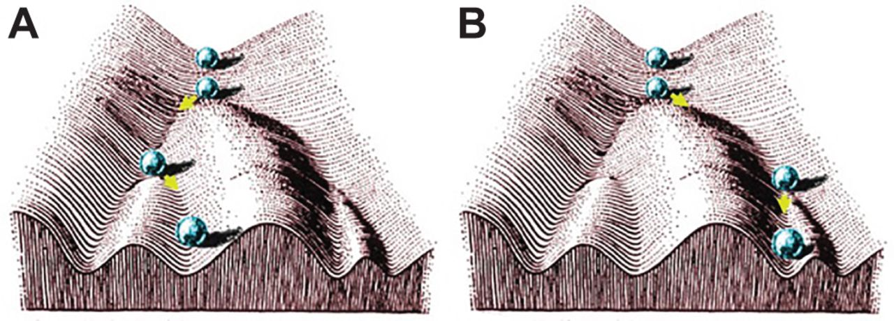

# What is hclust_mix? 

h: Hopfield networks, clust: clustering, mix: attractor analysis.

These tools are adapted for preprocessing and analysis of time-course developmental transcriptomic data using hclust 1.0, 
the algorithm was proposed by Stefan Maetschke and Mark Ragan to characterize cancer subtypes, [Maetschke and Mark Ragan, Bioinformatics (2014)](https://academic.oup.com/bioinformatics/article/30/9/1273/234782). The original version of hclust along with a short tutorial are available at:
[http://bioinformatics.org.au/tools/hclust/](http://bioinformatics.org.au/tools/hclust/). The idea behind their algorithm was to "demonstrate the usage 
of Hopfield networks for clustering, feature selection and network inference" [see tutorial by Mark Ragan](http://bioinformatics.org.au/tools/hclust/)  applied to transcriptomic data. Specifically it aims to model differentiated cell states as attractor states of a Hopfield Network, and was tested in 12 single-cell data sets including Haematopoiesis and human stem cell differentiation, [Fard et al. npj Syst Biol Appl 2, (2016)](https://www.nature.com/articles/npjsba20161).

## 1.  Hopfield network model and hclust workflow

In 1982 John Hopfield proposed a model of neural network to understand how neurons can storage information. Nodes in the network are neurons with binary states (-1,+1) and edges between them are called weights, these can be updated according to a rule called Hebb's rule. Neuron states can be updated using these weights. An important property of  this network is that it can converge from an initial state to a stable state called an attractor, this convergence is achieved by minimizing an *energy function*, [Hopfield PNAS (1982)](https://www.pnas.org/content/79/8/2554); [Rojas, Springer-Verlag (1996)](http://page.mi.fu-berlin.de/rojas/neural/index.html.html). This type of neural network can be used for retrieving patterns that have been corrupted by noise, a good illustrative example can be found in [this Jupyter notebook by Filippo Galli](https://github.com/philipjk/genetic_algorithm_optimization_sklearn-based/blob/master/hopfield_networks.ipynb). 

The model proposed by Maetschke and Mark Ragan borrows this idea, but instead of neurons, nodes are genes and weights represent co-expresion, the initial pluripotent states can converge to an attractor that represents a differentiated cell state. Additionally they use a ternary set of node states (-1, 0, +1),  [Maetschke and Mark Ragan, Bioinformatics (2014)](https://academic.oup.com/bioinformatics/article/30/9/1273/234782); [Fard et al. npj Syst Biol Appl 2, (2016)](https://www.nature.com/articles/npjsba20161). The basic steps of hclust workflow are: 

1. Normalization of expression matrix and feaure selection (genes with highest variance). 
2. Discretizing normalized expression matrix. 
2. Compute initial weight matrix.
3. Iterate to minimize energy function until convergence to attactor states. 
4. Visualization of energy landscape in PCA space.

There are important mathematical properties for this type of algorithm: 

1. Symmetric zero-diagonal weight matrix is required for convergence to attractors. 
2. This property does not provides the exact number of steps required for all states to converge. 
3. For non-symmetric zero-diagonal weight matrices, the states will be cyclic instead of convergent. 

In this case the algorithm works with a symmetric zero-diagonal weight matrix, but we do not know a priori the number of steps required for convergence, then we need to choose a number of steps and check if convergence occurs for all samples, for this reason it is a good idea to use large number of steps to search attractors. Samples that do not converge with a given number of steps are identified by the algorithm. For more about important properties of Hopfield networks  see chapter 13 in [Rojas, Springer-Verlag (1996)](http://page.mi.fu-berlin.de/rojas/neural/index.html.html).


## 2.  Usage
The current version has only been tested in Linux (Ubuntu 18.04.4 LTS), but you could try to set up a conda environment in other OS's, see the requirements below. After downloading the repository, you can use *unzip* to extract the files: 

```shell
unzip -q hclust_mix-master.zip
```


### 2.2  Requirements
The script requires Python 2.7.16 with numpy, scipy, pandas, scikit-learn, and matplotlib/seaborn. An easy way to make it work is to use the following steps in [conda](https://docs.conda.io/projects/conda/en/latest/user-guide/install/) (should work for versions >= 4.8.3) to create and activate an environment:

 
```shell
conda create --name envhmix python=2.7.16
```

```shell
conda activate envhmix
```

```shell
conda install -c conda-forge numpy scipy pandas scikit-learn matplotlib seaborn	
```
During the following steps this environment should be active in order to run the tests and check the example data sets, if you wish to return to the base/normal environment you only have to exit using:

```shell
conda deactivate
```


###  2.2 Gene expression matrix format
Both counts or normalized matrix are allowed, you only should remember to normalize if counts are provided, rows for genes and columns for samples. Additionally two column labels are required in the following order: (1) unique sample labels to identify each sample, (2) type labels that identify a condition, cell type/line or previous classification of samples. This is required because the algorithm will assign samples that converge to the same attractor to the same cluster and this is then compared to the known type labels. As an example run     


```shell
python checkmat_format.py
```

The output should look like this: 

```shell

sample_labels: 
 
['0', '1', '2', '3', '4', '5', '6', '7', '8', '9', '10', '11', '12', '13', '14', '15', '16', '17', '18', '19', '20', '21', '22', '23', '24', '25', '26', '27', '28', '29', '30', '31', '32', '33', '34', '35', '36', '37', '38', '39', '40', '41', '42', '43', '44', '45', '46', '47', '48', '49', '50', '51', '52', '53', '54', '55', '56', '57', '58', '59', '60', '61', '62', '63', '64', '65', '66', '67', '68', '69', '70', '71', '72', '73', '74', '75', '76', '77', '78', '79', '80', '81', '82', '83', '84', '85']


type_labels: 
 
['B-ALL', 'B-ALL', 'B-ALL', 'B-ALL', 'B-ALL', 'B-ALL', 'B-ALL', 'B-ALL', 'B-ALL', 'B-ALL', 'B-ALL', 'B-ALL', 'B-ALL', 'B-ALL', 'B-ALL', 'B-ALL', 'B-ALL', 'B-ALL', 'B-ALL', 'B-ALL', 'B-ALL', 'B-ALL', 'B-ALL', 'B-ALL', 'B-ALL', 'B-ALL', 'B-ALL', 'B-ALL', 'B-ALL', 'B-ALL', 'B-ALL', 'B-ALL', 'B-ALL', 'B-ALL', 'B-ALL', 'B-ALL', 'B-ALL', 'B-ALL', 'B-ALL', 'B-ALL', 'B-ALL', 'B-ALL', 'B-ALL', 'T-ALL', 'T-ALL', 'T-ALL', 'T-ALL', 'T-ALL', 'T-ALL', 'T-ALL', 'T-ALL', 'T-ALL', 'T-ALL', 'T-ALL', 'T-ALL', 'T-ALL', 'T-ALL', 'T-ALL', 'T-ALL', 'T-ALL', 'T-ALL', 'T-ALL', 'T-ALL', 'T-ALL', 'T-ALL', 'T-ALL', 'T-ALL', 'T-ALL', 'T-ALL', 'T-ALL', 'T-ALL', 'T-ALL', 'T-ALL', 'T-ALL', 'T-ALL', 'T-ALL', 'T-ALL', 'T-ALL', 'T-ALL', 'T-ALL', 'T-ALL', 'T-ALL', 'T-ALL', 'T-ALL', 'T-ALL', 'T-ALL']

Matrix format is correct. 

```

This column labels are from the example data set in this guide (`test_yeoh_reduced/yeoh_reduced.tsv`). In this microarray data set (86 samples, 50 genes) the type labels correspond to cancer sub-types, specifically acute lymphoblastic leukemia (ALL) sub-types from [Yeoh et al. Cancer Cell (2002)](https://www.cell.com/cancer-cell/fulltext/S1535-6108(02)00032-6). Original file can be downloaded from hclust 1.0 tutorial, [here](http://bioinformatics.org.au/tools/hclust/bin/hclust.zip).


### 2.3  How to use
Syntax: 

```shell
hclust_mix.py dataset_dir/expresion_matrix.tsv -n -f -p N
```
Where:
1. -n : enable normalization
2. -f : enable feature selection
3. -p : enable pruning of the initial weight matrix 
4.  N : Number of steps to search attractors (for example 100 or 1e2)

Now, let's run the script using the example data set: 

```shell
python hclust_mix.py test_yeoh_reduced/yeoh_reduced.tsv -p 10
```
Note that the following is equivalent:

```shell
python hclust_mix.py test_yeoh_reduced/yeoh_reduced.tsv -p 1e1
```
So, if you would like to use for example *1000* steps you can use *1e3* instead.  


### 2.4  Results
All results described for this example are available in the `test_results_yeoh_reduced/` folder. Output files are saved in the folder were the script was extracted:

1. general_summary.txt : total_genes, total_samples, unique_attractors. 
2. attractor_summary.txt: attractor (attractor label: A1, A2, etc.), genes_high (+1), genes_low (-1), genes_zero (0), nsamples (number of samples that converged to the attractor).
3. attractor_search_summary.txt: total_samples, samples_converged, samples_not_converged, total_genes, feature_genes (total number of genes selected as features), steps (number of steps used to search the attractors).
4. attractor_content_summary.txt: contains the attractor labels and the number of samples per type contained in each of them.  
5. attractors.ats: contains genes in rows and samples converged to attractor states in columns. 
 
 Detailed results for each attractor are saved in `attractor_results/`:
 
 1. Attactor state .tab files. 
 2. Gene state predictions (-1, 0, +1) for each attractor: .ids files.
 3. samples_attractors.tab (tab-delimited): sample, type, attractor for all converged samples. 
 
 Additionally nine plots are generated, here six of them are described, 4_energy_landscape.png and 5_PCA_landscape.png represent energy function landscape in PCA space, but they are omitted here because they are only useful for small number of samples and are better understood using a dynamic visualization tool, see section 2.4 below. Initial weight matrix plot (2_weight_matrix.png) is also omitted here.<br/><br/>

<br/><br/> 
Figure 1: 1_relaxation_state_matrix.png. Shows the transposed expression matrix, genes in columns and samples as rows for N relaxation steps. This is helpful to visualize how the initial matrix converges to attractors. However, it becomes difficult to visualize for large N (N = 10 in this example).   

<br/>
Figure 2: 3_pruning_threesholds.png. If the initial weight matrix is pruned this shows the True Rand Index (TRI), Estimated Rand Index (ERI), and density of the initial weight matrix, dashed vertical line indicates the best estimated pruning threshold for the data set. Density is defined as the percentage of non-zero entries in the weight matrix. Pruning means that initial weights that are lower than the threshold are set to zero.<br/><br/>

<br/>
Figure 3: 6_PCA_contour_plot.png. A 2-dimensional PCA space showing samples (colored by type) converged to attractors (green dots in this example). Might be difficult to visualize for very large number of samples.<br/><br/>

<br/>
Figure 4: attractors_barplot.png. Fractions of sample types in each attractor. Only one sample (*sample_label: 15*, *type_label: B-ALL*) was misclassified (converged to attractor *A2* associated to type *T-ALL*) as reported by  [Maetschke and Mark Ragan, Bioinformatics (2014)](https://academic.oup.com/bioinformatics/article/30/9/1273/234782). <br/><br/> 

<br/>
Figure 5: attractors_dendrogram.png. Dendrogram to visualize relationships between attractors.<br/><br/>

<br/>
Figure 6: attractors_heatmap.png. Expresion patterns of attractors, samples clustered by its attractor in columns and genes in rows. In this example there is a very symmetric pattern, that means that genes with a predicted hight state (+1) in one attractor have a low state (-1) in the other one, with a set of genes that are predicted to have a zero state (0) in both attractors.<br/><br/>    

### 2.4  Other examples
Other cancer gene expression data sets are available in `de_souto_datasets.zip` from [de Souto et al. Bioinformatics (2008)](https://bmcbioinformatics.biomedcentral.com/articles/10.1186/1471-2105-9-497); [Maetschke and Mark Ragan, Bioinformatics (2014)](https://academic.oup.com/bioinformatics/article/30/9/1273/234782) , it originally contained 35 expression matrices and can be downloaded [here](http://bioinformatics.org.au/tools/hclust/data/de_souto.zip), only 29 matrices that had unique sample labels were used (omitted matrices: dc_garber-2001, dc_khan-2001, sc_bhattacharjee-2001, sc_golub-1999-v1, sc_golub-1999-v2, sc_west-2001). If you would like to process this set, only use the following: 

```shell
unzip -q de_souto_datasets.zip
```

```shell
./tests_hclustmix.sh
```

By default the script uses *N = 500* steps for searching attractors for all matrices, but another values can be used as well. Results will be saved in a folder called `all_results_de_souto_datasets/`, if you would like only to check the results without running the script: 

```shell
unzip -q test_results_de_souto_datasets.zip
```
To see how hclust 1.0 works use:

```shell
python hclust.py test_yeoh_reduced/yeoh_reduced.tsv -p
 ```


## 3. Limitations

While this approach is quite good ilustrating how differentiated cell states tend to stabilize compared to transient cell states, it might not be the the option to choose if you wish to understand or model cell differentiation in general, unless you perform a benchmark analysis to determine that this method outperforms other methods in predicting differentiated cell states. So, if you would like to start learning about cell differentiation models hclust is a good starting point. However, if you are interested in questions related to regulation of cell differentiation using single-cell transcriptomics datasets, there are other packages such as [RNA velocity](http://velocyto.org/); [La Manno, Nature (2018)](https://www.nature.com/articles/s41586-018-0414-6), or [Monocle](http://cole-trapnell-lab.github.io/monocle-release/); [Trapnell, Nat. Biotechnol. (2014)](https://www.nature.com/articles/nbt.2859) that provide useful analysis tools. 


## 4. Final remarks: Waddington epigenenetic landscape 

[Conrad Hal Waddington](https://en.wikipedia.org/wiki/C._H._Waddington) in his 1957 book *The strategy of the genes* (London: George Allen & Unwin) proposed a metaphor to explain how a pluripotent cell becomes a differentiated cell. In his metaphor the pluripotent cell is like a ball at the top of a hill, while this cell differentiates it moves down through the rugged landscape of the hill until it reaches the bottom, that is a fully differentiated state. Genes modify this lanscape to allow only certain paths to exist, in such a way that there is only a limited number of possible outcomes.<br/><br/>    

 
Figure 7. Waddington Epigenetic Landscape as a metaphor for cell differentiation. A and B represent different differentiation paths, figure adapted from original Waddington's book from [Noble J. Exp. Biol. (2015)](https://jeb.biologists.org/content/218/6/816).<br/><br/>

Finally, a very important aspect of this metaphor is that if cells differentiated in this way, most cells would be observed to differentiate in a very deterministic way and this process should be regulated by a very stable expression of lineage-specific genes. Some authors have proposed that this might not 
be the case, at least considering new evidence from single-cell transcriptomes, see for example  multilineage priming effect in frog and fish from [Klein et al. Science (2018)](https://science.sciencemag.org/content/360/6392/eaar5780). For a detailed discussion about Waddington's ideas see for example [Huang BioEssays (2011)](https://onlinelibrary.wiley.com/doi/abs/10.1002/bies.201100031) and [Noble J. Exp. Biol. (2015)](https://jeb.biologists.org/content/218/6/816).

## References

1.	[Briggs, J. A. et al. The dynamics of gene expression in vertebrate embryogenesis at single-cell resolution. Science 360, (2018).](https://science.sciencemag.org/content/360/6392/eaar5780) 
2.	[de Souto, M. C., Costa, I. G., de Araujo, D. S., Ludermir, T. B. & Schliep, A. Clustering cancer gene expression data: a comparative study. BMC Bioinformatics 9, 497 (2008).](https://bmcbioinformatics.biomedcentral.com/articles/10.1186/1471-2105-9-497) 
3.	[Hopfield, J. J. Neural networks and physical systems with emergent collective computational abilities. PNAS 79, 2554–2558 (1982).](https://www.pnas.org/content/79/8/2554) 
4.	[Huang, S. The molecular and mathematical basis of Waddington’s epigenetic landscape: A framework for post‐Darwinian biology? BioEssays 34, 149–157 (2012).](https://onlinelibrary.wiley.com/doi/abs/10.1002/bies.201100031) 
5. [ La Manno, G. et al. RNA velocity of single cells. Nature 560, 494–498 (2018).](https://www.nature.com/articles/s41586-018-0414-6)	
6.	[Maetschke, S. R. & Ragan, M. A. Characterizing cancer subtypes as attractors of Hopfield networks. Bioinformatics 30, 1273–1279 (2014).](https://academic.oup.com/bioinformatics/article/30/9/1273/234782) 
7.	[Noble, D. Conrad Waddington and the origin of epigenetics. Journal of Experimental Biology 218, 816–818 (2015).](https://jeb.biologists.org/content/218/6/816) 
8. [Rojas, R. Neural Networks - A Systematic Introduction. Springer-Verlag (1996).](https://page.mi.fu-berlin.de/rojas/neural/) 
9.	[Trapnell, C. et al. The dynamics and regulators of cell fate decisions are revealed by pseudotemporal ordering of single cells. Nat Biotechnol 32, 381–386 (2014).](https://www.nature.com/articles/nbt.2859)
10.	[Yeoh, E.-J. et al. Classification, subtype discovery, and prediction of outcome in pediatric acute lymphoblastic leukemia by gene expression profiling. Cancer Cell 1, 133–143 (2002).](https://www.cell.com/cancer-cell/fulltext/S1535-6108(02)00032-6)

## See also: 

1. [Simple implementation of a Hopfield network used to restore randomly generated images of corrupted rectangles, Jupyter notebook by Filippo Galli.](https://github.com/philipjk/genetic_algorithm_optimization_sklearn-based/blob/master/hopfield_networks.ipynb)

2. [Hopfield Networks is All You Need by Johannes Brandstetter et al. (2020).](https://ml-jku.github.io/hopfield-layers/)


