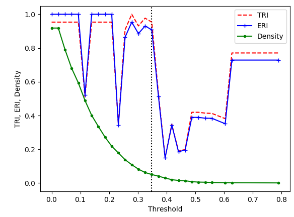

# What is hclust_mix? 

h: Hopfield networks, clust: clustering, mix: attractor analysis and some tools to process the data.

These tools are adapted for preprocessing and analysis of time-course developmental transcriptomic data using hclust 1.0, 
the algorithm was proposed by Stefan Maetschke and Mark Ragan to characterize cancer subtypes, [Maetschke and Mark Ragan, Bioinformatics (2014)](https://academic.oup.com/bioinformatics/article/30/9/1273/234782). The original version of hclust along with a short tutorial are available at:
[http://bioinformatics.org.au/tools/hclust/](http://bioinformatics.org.au/tools/hclust/). The idea behind their algorithm was to "demonstrate the usage 
of Hopfield networks for clustering, feature selection and network inference" [see tutorial by Mark Ragan](http://bioinformatics.org.au/tools/hclust/)  applied to transcriptomic data. Specifically it aims to model differentiated cell states as attractor states of a Hopfield Network, and was tested in 12 single-cell data sets including Haematopoiesis and human stem cell differentiation, [Fard et al. npj Syst Biol Appl 2, (2016)](https://www.nature.com/articles/npjsba20161).

## 1.  Hopfield network model and hclust workflow

In 1982 John Hopfield proposed a model of neural network to understand how neurons can storage information. Nodes in the network are neurons with binary states (-1,+1) and edges between them are called weights, these can be updated according to a rule called Hebb's rule. Neuron states can be updated using these weights. An important property of  this network is that it can converge from an initial state to a stable state called an attractor, this convergence is achieved by minimizing an "energy function", [Hopfield PNAS (1982)](https://www.pnas.org/content/79/8/2554); [Rojas Springer-Verlag (1996)](http://page.mi.fu-berlin.de/rojas/neural/index.html.html). This type of neural network can be used for retrieving patterns that have been corrupted by noise, a good illustrative example can be found in [this Jupyter notebook by Filippo Galli](https://github.com/philipjk/genetic_algorithm_optimization_sklearn-based/blob/master/hopfield_networks.ipynb). 

The model proposed by Maetschke and Mark Ragan borrows this idea, but instead of neurons, nodes are genes and weights represent co-expresion, the initial pluripotent states can converge to an attractor that represents a differentiated cell state. Additionally they use a ternary set of node states (-1, 0, +1),  [Maetschke and Mark Ragan, Bioinformatics (2014)](https://academic.oup.com/bioinformatics/article/30/9/1273/234782); [Fard et al. npj Syst Biol Appl 2, (2016)](https://www.nature.com/articles/npjsba20161). The basic steps of hclust workflow are: 

1. Normalization of expression matrix and feaure selection (genes with highest variance). 
2. Discretizing normalized expression matrix. 
2. Compute initial weight matrix.
3. Iterate to minimize energy function until convergence to attactor states. 
4. Visualization of energy landscape in PCA space.


## 2. Usage
Only works in Linux (Ubuntu 18.04.4 LTS), but you could try to set up a conda environment in other OS's.   


### 2.2 Requirements
The script requires Python 2.7.16 with numpy, scipy, pandas, scikit-learn, and matplotlib/seaborn. An easy way to make it work is to use the following steps in [conda](https://docs.conda.io/projects/conda/en/latest/user-guide/install/) (should work for versions >= 4.8.3) to create and activate an environment:

 
```shell
conda create --name envhmix python=2.7.16
```

```shell
conda activate envhmix
```

```shell
conda install -c conda-forge numpy scipy pandas scikit-learn matplotlib seaborn	
```
During the following steps this environment should be active, if you wish to return to the base/normal environment, only use: 

```shell
conda deactivate
```


### 2.2 Gene expression matrix format
Both counts or normalized matrix are allowed, you only should remember to normalize if counts are provided, rows for genes and columns for samples. Additionally two column labels are required in the following order: (1) unique sample labels to identify each sample, (2) type labels that identify a condition, cell type/line or previous classification of samples. This is required because the algorithm will assign samples that converge to the same attractor to the same cluster and this is then compared to the known type labels. As an example run     


```python
checkmat_format.py
```

The output should look like this: 

```shell

sample_labels: 
 
['0', '1', '2', '3', '4', '5', '6', '7', '8', '9', '10', '11', '12', '13', '14', '15', '16', '17', '18', '19', '20', '21', '22', '23', '24', '25', '26', '27', '28', '29', '30', '31', '32', '33', '34', '35', '36', '37', '38', '39', '40', '41', '42', '43', '44', '45', '46', '47', '48', '49', '50', '51', '52', '53', '54', '55', '56', '57', '58', '59', '60', '61', '62', '63', '64', '65', '66', '67', '68', '69', '70', '71', '72', '73', '74', '75', '76', '77', '78', '79', '80', '81', '82', '83', '84', '85']


type_labels: 
 
['B-ALL', 'B-ALL', 'B-ALL', 'B-ALL', 'B-ALL', 'B-ALL', 'B-ALL', 'B-ALL', 'B-ALL', 'B-ALL', 'B-ALL', 'B-ALL', 'B-ALL', 'B-ALL', 'B-ALL', 'B-ALL', 'B-ALL', 'B-ALL', 'B-ALL', 'B-ALL', 'B-ALL', 'B-ALL', 'B-ALL', 'B-ALL', 'B-ALL', 'B-ALL', 'B-ALL', 'B-ALL', 'B-ALL', 'B-ALL', 'B-ALL', 'B-ALL', 'B-ALL', 'B-ALL', 'B-ALL', 'B-ALL', 'B-ALL', 'B-ALL', 'B-ALL', 'B-ALL', 'B-ALL', 'B-ALL', 'B-ALL', 'T-ALL', 'T-ALL', 'T-ALL', 'T-ALL', 'T-ALL', 'T-ALL', 'T-ALL', 'T-ALL', 'T-ALL', 'T-ALL', 'T-ALL', 'T-ALL', 'T-ALL', 'T-ALL', 'T-ALL', 'T-ALL', 'T-ALL', 'T-ALL', 'T-ALL', 'T-ALL', 'T-ALL', 'T-ALL', 'T-ALL', 'T-ALL', 'T-ALL', 'T-ALL', 'T-ALL', 'T-ALL', 'T-ALL', 'T-ALL', 'T-ALL', 'T-ALL', 'T-ALL', 'T-ALL', 'T-ALL', 'T-ALL', 'T-ALL', 'T-ALL', 'T-ALL', 'T-ALL', 'T-ALL', 'T-ALL', 'T-ALL']

Matrix format is correct. 

```

This column labels are for the test data set in this guide ( `test_yeoh_reduced/yeoh_reduced.tsv` directory)


### 2.3 How to use


### 2.4 Results





## 3. Limitations

While this approach is quite good ilustrating how differentiated cell states tend to stabilize compared to transient cell states, it might not be the the option to choose if you wish to understand or model cell differentiation in general, unless you perform a benchmark analysis to determine that this method outperforms other methods in predicting differentiated cell states. So, if you would like to start learning about cell differentiation models hclust is a good starting point. However, if you are interested in questions related to regulation of cell differentiation using single-cell transcriptomics datasets, there are other packages such as [RNA velocity](http://velocyto.org/), or [Monocle](http://cole-trapnell-lab.github.io/monocle-release/) that provide useful analysis tools. 


## 4. Final remarks: Waddington epigenenetic landscape 

[Conrad Hal Waddington](https://en.wikipedia.org/wiki/C._H._Waddington) in his 1957 book *The strategy of the genes* (London: George Allen & Unwin) proposed a metaphor to explain how a pluripotent cell becomes a differentiated cell. In his metaphor the pluripotent cell is like a ball at the top of a hill, while this cell differentiates it moves down through the rugged landscape of the hill until it reaches the bottom, that is a fully differentiated state. Genes modify this lanscape to allow only certain paths to exist, in such a way that there is only a limited number of possible outcomes.    

# 
Figure 1. Waddington Epigenetic Landscape. A and B represent different differentiation paths, [Noble J. Exp. Biol. (2015)](https://jeb.biologists.org/content/218/6/816).

Finally, a very important aspect of this metaphor is that if cells differentiated in this way, most cells would be observed to differentiate in a very deterministic way and this process should be regulated by a very stable expression of lineage-specific genes. Some authors have proposed that this might not 
be the case, at least considering new evidence from single-cell transcriptomes, see for example  multilineage priming effect in frog and fish from [Klein et al. Science (2018)](https://science.sciencemag.org/content/360/6392/eaar5780). For a detailed discussion about Waddington's ideas see for example [Huang BioEssays (2011)](https://onlinelibrary.wiley.com/doi/abs/10.1002/bies.201100031) and [Noble J. Exp. Biol. (2015)](https://jeb.biologists.org/content/218/6/816).

## References


